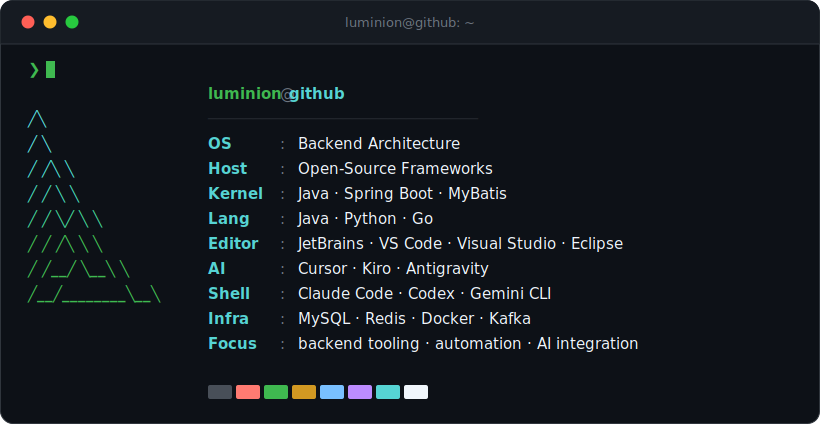

<div align="center">
  
</div>

<div align="center">
  
</div>

<p align="center">
  <a href="https://github.com/luminion?tab=repositories"></a>
  <a href="https://github.com/luminion"></a>
  
</p>

<div align="center">
  
</div>

## `❯ whoami`

Backend engineer building open-source Java frameworks and developer tooling. I like clean abstractions, dependency-light libraries, and infrastructure that stays readable under pressure.

Lately I turn repetitive backend work into reusable starters and generators, and wire LLMs into real Java services.

## `❯ ls ~/open-source`

<table>
  <tr>
    <td valign="top" width="50%">
      <strong>◆ <a href="https://github.com/luminion/sql-booster">sql-booster</a></strong><br/>
      <sub>Query-enhancement toolkit for MyBatis / MyBatis-Plus built around a unified <code>SqlContext&lt;T&gt;</code> — dynamic composition, paging, sorting, and XML integration, kept consistent and maintainable.</sub>
    </td>
    <td valign="top" width="50%">
      <strong>◆ <a href="https://github.com/luminion/code-generator">code-generator</a></strong><br/>
      <sub>Lambda-style backend code generator for MyBatis-Plus and sql-booster — emits Entity, Mapper, Service, Controller, DTO, VO, and Excel models from customizable templates.</sub>
    </td>
  </tr>
  <tr>
    <td valign="top" width="50%">
      <strong>◆ <a href="https://github.com/luminion/spring-boot-starter">spring-boot-starter</a></strong><br/>
      <sub>Spring Boot starter for common scenarios following official conventions — idempotency, rate limiting, distributed locking, caching, XSS protection, and MyBatis-Plus wiring.</sub>
    </td>
    <td valign="top" width="50%">
      <strong>◆ <a href="https://github.com/luminion/helper">helper</a></strong><br/>
      <sub>JDK-first Java utility library — a dependency-light core with opt-in modules for datetime, tree structures, bean mapping, HTTP, files, and lambda metadata.</sub>
    </td>
  </tr>
</table>

## `❯ cat principles.txt`

```ansi
  ▸ build for maintainability first
  ▸ prefer explicit design over accidental complexity
  ▸ keep libraries dependency-light and opt-in
  ▸ treat debugging as a first-class engineering skill
```

## `❯ stack --all`

<div align="center">
  
</div>

<table>
  <tr>
    <td valign="top" width="33%"><strong>Languages</strong><br/><sub>Java · Python · Go</sub></td>
    <td valign="top" width="33%"><strong>Frameworks</strong><br/><sub>Spring Boot · MyBatis-Plus · Flask · LangChain4j</sub></td>
    <td valign="top" width="34%"><strong>Infra</strong><br/><sub>MySQL · PostgreSQL · Redis · Docker · Kafka · Jenkins</sub></td>
  </tr>
</table>

## `❯ git log --oneline`

```ansi
  * a1b9f2c feat: reusable framework abstractions
  * 7d3e0aa refactor: sharper codegen workflow
  * c04f1de feat: LangChain4j experiments & AI gateways
  * 5b8ee21 perf: turn complex systems into operable ones
```

## `❯ gh api /users/luminion/stats`

<div align="center">
  
</div>

## `❯ contrib --graph`

<div align="center">
  <picture>
    <source media="(prefers-color-scheme: dark)" srcset="https://raw.githubusercontent.com/luminion/luminion/output/github-contribution-grid-snake-dark.svg">
    <source media="(prefers-color-scheme: light)" srcset="https://raw.githubusercontent.com/luminion/luminion/output/github-contribution-grid-snake.svg">
    
  </picture>
</div>

<div align="center">
  
</div>

<div align="center">
  <sub><code>❯ exit</code> · <code>logout</code> · Connection to github.com closed.</sub>
</div>
