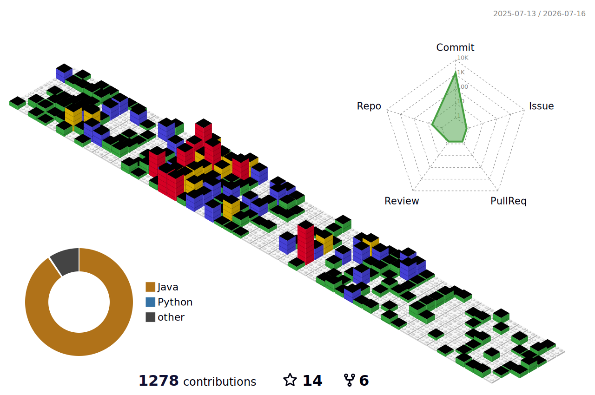

<div align="center">
  
</div>

<br/>

```json
{
  "name": "Luminion",
  "bio": "Code artisan & system architect 💻",
  "daily_tools": ["Claude Code", "Antigravity", "JetBrains IDE", "VSCode", "Visual Studio"],
  "hobbies": ["Open Source", "Music", "Debugging at 2 AM"]
}
```

<div align="center">
  <a href="https://github.com/luminion">
    
  </a>
  <a href="https://github.com/luminion">
    
  </a>
</div>

<br/>

### 🛠️ Tech Stack & Arsenal
<div align="center">
  <p><strong>Languages & Frameworks</strong></p>
  <a href="https://skillicons.dev">
    
  </a>
  <br/>
  <p><strong>Databases, DevOps & Tools</strong></p>
  <a href="https://skillicons.dev">
    
  </a>
</div>

<br/>

### 📊 GitHub Analytics
<!-- <div align="center">
  
  
</div> -->

<br/>

<div align="center">
  <!--  -->
  
</div>

<br/>

### 🐍 Contribution Activity
<div align="center">
  <picture>
    <source media="(prefers-color-scheme: dark)" srcset="https://raw.githubusercontent.com/luminion/luminion/output/github-contribution-grid-snake-dark.svg">
    <source media="(prefers-color-scheme: light)" srcset="https://raw.githubusercontent.com/luminion/luminion/output/github-contribution-grid-snake.svg">
    
  </picture>
</div>

<br/>

<details>
  <summary><b>✨ 3D Contributions</b></summary>
  <br/>
  <div align="center">
    
    <!-- <br/> -->
    <!--  -->
  </div>
</details>

<br/>

<div align="center">
  
</div>
