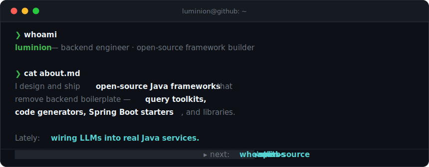

  

  

  
  
  
  

<!-- ─────────────────────────────  FLAGSHIP  ───────────────────────────── -->

## `❯ cat ~/open-source/README.md`

Published libraries on Maven Central under <code>io.github.luminion</code> — built to remove backend boilerplate.

<table>
  <tr>
    <td valign="top" width="50%">
      <strong>◆ <a href="https://github.com/luminion/sql-booster">sql-booster</a></strong>&nbsp; 
      Query-enhancement toolkit for MyBatis / MyBatis-Plus. A unified <code>SqlContext&lt;T&gt;</code> model with <code>lambdaBooster()</code> chaining, suffix operators (<code>ageGte</code>, <code>nameLike</code>, <code>stateIn</code>), and field-whitelist SQL-injection protection.
    </td>
    <td valign="top" width="50%">
      <strong>◆ <a href="https://github.com/luminion/code-generator">code-generator</a></strong>&nbsp; 
      Dual-mode backend code generator for MyBatis-Plus and sql-booster. Emits Entity, Mapper/XML, Service, Controller, DTO/VO, and EasyExcel models from customizable, override-friendly templates.
    </td>
  </tr>
  <tr>
    <td valign="top" width="50%">
      <strong>◆ <a href="https://github.com/luminion/spring-boot-starter">spring-boot-starter</a></strong>&nbsp; 
      Opinionated auto-configuration under a unified <code>velo.*</code> namespace. <code>@Idempotent</code>, <code>@RateLimit</code>, <code>@Lock</code> with auto-selected backends, cache TTL jitter, TraceId/MDC logging, and XSS sanitization — across Spring Boot 2 / 3 / 4.
    </td>
    <td valign="top" width="50%">
      <strong>◆ <a href="https://github.com/luminion/helper">helper</a></strong>&nbsp; 
      JDK-first Java utility library — a dependency-light core with opt-in modules for datetime, collections, trees, bean mapping, HTTP, JSON, reflection, and geo operations.
    </td>
  </tr>
</table>

<!-- ─────────────────────────────  STACK  ───────────────────────────── -->

## `❯ stack --all`

[//]: # (
)

[//]: # ()
[//]: # (  )

[//]: # ()
[//]: # (
)

<table>
  <tr>
    <td valign="top" width="33%"><strong>Languages</strong> Java · Python · Go · C# · SQL</td>
    <td valign="top" width="33%"><strong>Frameworks</strong> Spring Boot · MyBatis-Plus · Flask · Vue · LangChain4j · Spring AI</td>
    <td valign="top" width="34%"><strong>Infra & Data</strong> MySQL · PostgreSQL · Redis · Elasticsearch · Docker · Kafka · RabbitMQ · Jenkins</td>
  </tr>
</table>

<!-- ─────────────────────────────  CONTRIB  ───────────────────────────── -->

## `❯ contrib --graph`

  <picture>
    <source media="(prefers-color-scheme: dark)" srcset="https://raw.githubusercontent.com/luminion/luminion/output/github-contribution-grid-snake-dark.svg">
    <source media="(prefers-color-scheme: light)" srcset="https://raw.githubusercontent.com/luminion/luminion/output/github-contribution-grid-snake.svg">
    
  </picture>

  

  <code>❯ exit</code> · <code>logout</code> · Connection to github.com closed.

