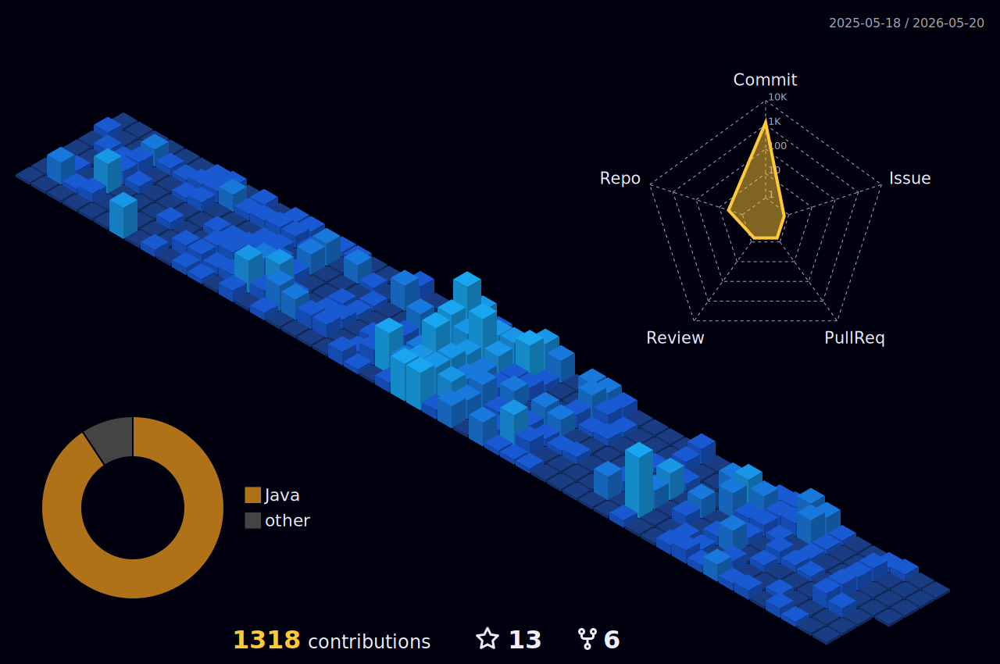

<div align="center">
  
</div>

<div align="center">
  
</div>

<p align="center">
  <a href="https://github.com/luminion">
    
  </a>
  
  
  
  
</p>

```yaml
name: Luminion
role: Backend Architect / Open Source Builder
specialties:
  - Java & Spring ecosystem
  - .NET engineering
  - Development tooling & automation
  - Developer tooling & code generation
  - Open source framework design
  - Distributed systems, middleware, and data infrastructure
working_principles:
  - Build for maintainability first
  - Prefer explicit design over accidental complexity
  - Treat debugging as a first-class engineering skill
  - Create tools that improve engineering leverage
```

<div align="center">
  
</div>

I build backend systems, internal tooling, and open source frameworks with a strong preference for clarity, maintainability, and designs that stay readable under pressure.

I care about practical tooling, clean abstractions, and engineering workflows that make complex systems more operable and less surprising.

<div align="center">
  
</div>

```bash
$ dev.toolchain list

editors   : Cursor, Kiro
terminals : Claude Code, Codex CLI, Gemini CLI
workflow  : Antigravity, Augment
focus     : fast iteration, deep debugging, automation
```

<p align="center">
  
  
  
  
  
  
  
</p>

<div align="center">
  
</div>

<table>
  <tr>
    <td valign="top" width="50%">
      <strong>SQL Booster</strong><br/>
      A query enhancement toolkit for MyBatis / MyBatis-Plus built around a unified <code>SqlContext&lt;T&gt;</code> model, designed to make dynamic query composition, paging, sorting, and XML integration more consistent and maintainable.
    </td>
    <td valign="top" width="50%">
      <strong>code-generator</strong><br/>
      A Lambda-style backend code generator for MyBatis-Plus and SQL-Booster workflows, focused on producing production-oriented Entity, Mapper, Service, Controller, DTO, VO, and Excel models with customizable templates and stable configuration entry points.
    </td>
  </tr>
  <tr>
    <td valign="top" width="50%">
      <strong>helper</strong><br/>
      A JDK-first Java helper library that keeps base capability dependency-light while exposing practical modules for datetime, tree structures, bean mapping, HTTP, file handling, lambda metadata, geo operations, and optional third-party integrations on demand.
    </td>
    <td valign="top" width="50%">
      <strong>spring-boot-starter</strong><br/>
      A Spring Boot starter/autoconfigure toolkit aligned with official starter conventions, covering idempotency, rate limiting, distributed locking, Jackson, Redis, caching, MyBatis-Plus, web enhancement, XSS protection, and multi-version Boot 2 / 3 / 4 support.
    </td>
  </tr>
</table>

<div align="center">
  
</div>

<p align="center">
  
  
  
  
</p>

<div align="center">
  
</div>

<div align="center">
  
</div>

<table>
  <tr>
    <td valign="top" width="33%">
      <strong>Languages</strong><br/>
      Java, C#, Python, JavaScript
    </td>
    <td valign="top" width="33%">
      <strong>Frameworks</strong><br/>
      Spring Boot, .NET, Flask, Vue, Flutter
    </td>
    <td valign="top" width="33%">
      <strong>Infra</strong><br/>
      MySQL, PostgreSQL, Redis, Elasticsearch, Docker, Kafka, RabbitMQ, Jenkins
    </td>
  </tr>
</table>

<div align="center">
  
</div>

<p align="center">
  
  
  
  
</p>

<div align="center">
  
</div>

<div align="center">
  
</div>

<div align="center">
  
</div>

<div align="center">
  <picture>
    <source media="(prefers-color-scheme: dark)" srcset="https://raw.githubusercontent.com/luminion/luminion/output/github-contribution-grid-snake-dark.svg">
    <source media="(prefers-color-scheme: light)" srcset="https://raw.githubusercontent.com/luminion/luminion/output/github-contribution-grid-snake.svg">
    
  </picture>
</div>

<!-- <details>
  <summary><strong>3D Contribution View</strong></summary>
  <br/>
  <div align="center">
    
  </div>
</details> -->

<div align="center">
  
</div>
