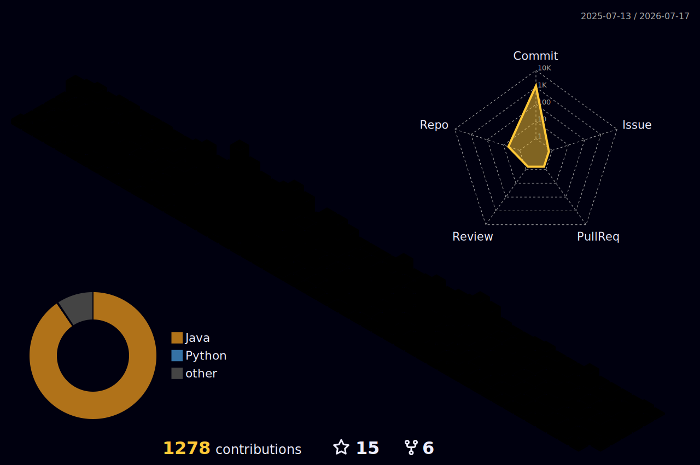

  

  

  
  
  
  

<table>
  <tr>
    <td width="56%" valign="top">

<pre><code>$ profile.load()
name: luminion
title: AI Engineer / Backend Architect
operators:
  - Claude Code
  - OpenAI Codex
  - Gemini
domains:
  - agentic engineering
  - backend architecture
  - code generation
  - developer tooling
core_stack:
  - Java / Spring
  - .NET / C#
  - Python / Automation</code></pre>

  
  
  
  
  

    </td>
    <td width="44%" align="center">
      
    </td>
  </tr>
</table>

  

  
  
  

## `FLAGSHIP FRAMEWORKS`

  
  

  
  

## `STACK`

  

## `SIGNAL / METRICS`

  

  
  

  

## `CONTRIBUTION FIELD`

  <picture>
    <source media="(prefers-color-scheme: dark)" srcset="https://raw.githubusercontent.com/luminion/luminion/output/github-contribution-grid-snake-dark.svg">
    <source media="(prefers-color-scheme: light)" srcset="https://raw.githubusercontent.com/luminion/luminion/output/github-contribution-grid-snake.svg">
    
  </picture>

  
<code>3d-render</code>

   
  

    
  

  

